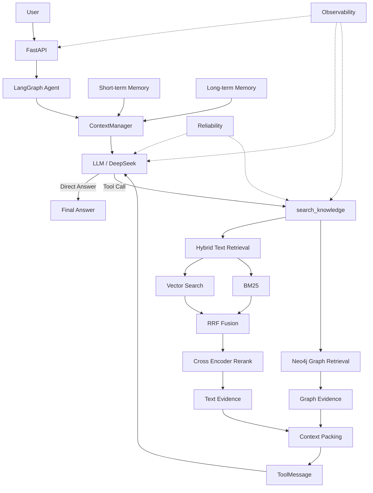

<div align="center">

# Enterprise GraphRAG Agent

**面向企业知识库场景的工程化智能 Agent**

基于 **FastAPI + LangGraph + DeepSeek**，融合 **Hybrid RAG、Neo4j Graph Retrieval、Memory、Context Engineering、Reliability、Observability 与 Agent Evaluation**。

<p>
  
  
  
  
  
</p>

</div>

---

## ✨ 项目简介

传统 RAG 往往只解决“**如何从文档中召回相关文本**”的问题，而一个真正可用的企业知识 Agent 还需要处理：

- 如何让 LLM **自主判断是否调用工具**
- 如何同时利用 **语义检索、关键词检索与实体关系**
- 如何管理 **多轮会话与跨会话长期信息**
- 如何控制 **上下文冲突与 Token Budget**
- 如何面对 **LLM / Neo4j / 外部服务异常**
- 如何通过 **日志、指标和 Evaluation** 定位 Agent Bad Case

本项目围绕这些问题，搭建了一条完整的 Agent Engineering Pipeline：

> **Agent Runtime → Hybrid RAG → GraphRAG → Memory → Context → Reliability → Observability → Evaluation**

---

## 🚀 核心亮点

| 模块 | 实现 |
|---|---|
| **Agent Runtime** | 基于 LangGraph 构建 `Agent → Tool → Observation → Agent` 状态流，由 LLM 动态决定直接回答或调用知识库 |
| **Hybrid RAG** | Vector Search + BM25 双路召回，RRF 融合，Cross Encoder Rerank，输出 Top-K Evidence |
| **GraphRAG** | 使用 Neo4j 检索实体、关系与关系路径，将 Graph Evidence 与 Text Evidence 联合提供给 LLM |
| **Memory** | `thread_id` 级 Short-term Memory + `user_id` 级 Long-term Memory |
| **Context Engineering** | 统一组装 System Prompt、History、Memory、Tool Result 与 Current Query，并处理信息优先级 |
| **Reliability** | Timeout、Retry、Exponential Backoff、Semaphore、Graceful Degradation |
| **Observability** | request_id / user_id / thread_id 全链路上下文 + Prometheus Metrics |
| **Evaluation** | Tool Selection、Tool Argument、Task Completion、Overall Pass Rate、Latency |

---

## 🧠 系统架构



---

## 🔍 Hybrid RAG

检索部分不是单一路 Vector Search，而是采用多阶段检索：

```text
Query
  ↓
Vector Search + BM25
  ↓
Recall
  ↓
RRF Fusion
  ↓
Candidate Documents
  ↓
Cross Encoder Rerank
  ↓
Top-K Text Evidence
```

### 为什么这样设计？

**Vector Search** 更擅长语义相似；**BM25** 对关键词、缩写、编号和专有名词更敏感。

两路结果不能简单直接相加，因为原始 Score 的量纲不同，因此使用 **RRF（Reciprocal Rank Fusion）** 基于排名进行融合；融合后再使用 **Cross Encoder** 对较小候选集进行精排，在效果与计算成本之间取得平衡。

---

## 🕸️ GraphRAG

Hybrid Text RAG 之外，项目同时接入 Neo4j：

```text
                Query
                  │
       ┌──────────┴──────────┐
       ▼                     ▼
Hybrid Text RAG       Graph Retrieval
       │                     │
Text Evidence         Graph Evidence
       └──────────┬──────────┘
                  ▼
           Context Packing
                  ▼
                 LLM
```

Graph Retrieval 当前用于显式表达：

- Entity
- Relation
- Target Entity
- Relationship Path

### Graceful Degradation

Neo4j 被设计为**增强链路，而不是单点强依赖**：

```text
Neo4j available
→ Text RAG + Graph Retrieval

Neo4j unavailable
→ Graph Results = []
→ Text RAG continues
```

因此即使图数据库异常，核心知识问答能力仍可继续工作。

---

## 🧩 Memory & Context Engineering

### Short-term Memory

使用 LangGraph Checkpointer：

```python
config = {
    "configurable": {
        "thread_id": thread_id
    }
}
```

相同 `thread_id` 可以恢复当前会话历史，不同 Thread 相互隔离。

> 当前使用 `InMemorySaver`，适合本地原型验证；服务重启或进程切换后状态会丢失。

### Long-term Memory

Long-term Memory 按 `user_id` 管理结构化用户信息：

```text
user_id
  ↓
key / value / importance
  ↓
Upsert
```

当前为 In-Memory 原型，生产环境可进一步迁移到 PostgreSQL / Redis / Vector Store。

### Context 优先级

```text
Current User Input
        >
Recent Conversation
        >
Long-term Memory
```

ContextManager 负责：

```text
Gather → Resolve → Budget → Assemble
```

避免旧 Memory 覆盖用户当前明确指令。

---

## 🛡️ Reliability

对 LLM 与外部依赖统一封装：

- **Timeout**：避免下游请求无限等待
- **Retry**：处理瞬时网络异常、限流、部分服务端错误
- **Exponential Backoff**：避免故障期间高频重试
- **Semaphore**：控制单实例最大并发
- **Graceful Degradation**：增强模块异常时优先保留核心能力

```text
Agent
  ↓
Semaphore
  ↓
Timeout
  ↓
LLM / Tool
  ↓ failed
Retry + Backoff
  ↓
Fallback / Degradation
```

---

## 📊 Observability

通过 ContextVar 将以下信息贯穿请求链路：

```text
request_id / user_id / thread_id
```

可关联：

```text
HTTP → Agent → LLM → Tool → RAG
```

Prometheus Metrics 覆盖：

- HTTP Requests / Latency
- LLM Calls / Latency
- Tool Calls / Latency

Metrics Endpoint：

```text
GET /metrics
```

---

## 🧪 Agent Evaluation

项目提供独立 Evaluation Pipeline：

```bash
python -m eval.evaluate_agent
```

当前指标：

| Metric | Demo Result |
|---|---:|
| Tool Selection Accuracy | **100%** |
| Tool Argument Accuracy | **100%** |
| Task Completion Rate | **100%** |
| Overall Pass Rate | **100%** |
| Average Latency | **1920.89 ms** |
| Evaluation Cases | **7** |

> 以上数据来自仓库中当前 Demo Evaluation Dataset 的一次样例运行，仅用于验证评测链路，并不代表大规模生产效果。

Evaluation 不只判断最终答案，还会拆解：

```text
Tool Selection
      ↓
Tool Arguments
      ↓
Task Completion
      ↓
End-to-End Result
```

这样可以区分“LLM 最终回答错”究竟来自 Tool 决策、参数生成、Retrieval 还是最终生成阶段。

---

## 📁 项目结构

```text
enterprise-graphrag-agent/
├── app/
│   ├── agent/          # LangGraph State / Node / Graph
│   ├── api/            # FastAPI Chat API
│   ├── core/           # Config / Reliability / Observability
│   ├── memory/         # Long-term Memory / ContextManager
│   ├── rag/            # Vector / BM25 / RRF / Rerank / Graph Retrieval
│   ├── schemas/        # Pydantic Schema
│   ├── services/       # LLM / Neo4j Client
│   ├── tools/          # search_knowledge
│   └── main.py
├── eval/               # Agent Evaluation
├── scripts/            # Neo4j Seed
├── tests/              # Manual Verification
├── .env.example
├── .gitignore
├── requirements.txt
└── README.md
```

---

## ⚡ Quick Start

### 1. 创建虚拟环境

```bash
python -m venv .venv
```

Windows PowerShell：

```powershell
.\.venv\Scripts\Activate.ps1
```

### 2. 安装依赖

```bash
pip install -r requirements.txt
```

### 3. 配置环境变量

复制 `.env.example` 为 `.env`：

```env
DEEPSEEK_API_KEY=your_deepseek_api_key
DEEPSEEK_BASE_URL=https://api.deepseek.com
DEEPSEEK_MODEL=deepseek-chat

NEO4J_URI=bolt://localhost:7687
NEO4J_USERNAME=neo4j
NEO4J_PASSWORD=your_neo4j_password
```

> 请勿将真实 API Key 或密码提交到 Git。

### 4. 初始化 Neo4j Demo 数据

```bash
python scripts/seed_neo4j.py
```

### 5. 启动 Agent API

```bash
python -m uvicorn app.main:app --host 127.0.0.1 --port 8001
```

本地验证 Short-term Memory 时不建议使用 `--reload`，因为当前 Checkpointer 为进程内 `InMemorySaver`。

---

## 🔌 API

### Health

```http
GET /health
```

### Chat

```http
POST /chat
```

Request：

```json
{
  "user_id": "user_001",
  "thread_id": "thread_001",
  "message": "GraphRAG项目的检索流程是什么？"
}
```

Response：

```json
{
  "answer": "..."
}
```

Swagger：

```text
http://127.0.0.1:8001/docs
```

---

## 🎬 推荐 Demo

### Demo 1 — Hybrid RAG

```text
GraphRAG项目的检索流程是什么？
```

验证：

```text
Vector + BM25 → RRF → Rerank
```

### Demo 2 — Graph Retrieval

```text
GraphRAG中的实体关系存储在哪里？
```

Neo4j 正常时，同时观察 Text Results 与 Graph Results。

### Demo 3 — Neo4j Degradation

关闭 Neo4j 后再次询问企业知识问题：

```text
Graph Results = 0
Text Results > 0
```

用于验证 Text RAG 的降级能力。

### Demo 4 — Short-term Memory

同一 `thread_id`：

```text
Round 1: 我正在开发一个 GraphRAG 项目。
Round 2: 我刚才说我正在开发什么项目？
```

### Demo 5 — Thread Isolation

更换新的 `thread_id` 后，不应继承上一 Thread 的 Short-term History。

---

## 💡 关键工程取舍

### 为什么用 RRF，而不是直接相加 Score？

Vector 与 BM25 的原始分值尺度不同；RRF 使用排名融合，无需强行对异构 Retriever 的 Score 做统一标定。

### 为什么先 Recall 再 Cross Encoder？

Cross Encoder 精度较高但计算成本更大，因此只对 Recall 后的小规模候选集做精排。

### 为什么 Neo4j 不作为强依赖？

Graph Retrieval 是增强能力。图服务异常时退化到 Text RAG，可以避免单个外部组件拖垮整个 Agent。

### 为什么 Memory 和 Context 分开？

Memory 是“可复用的信息存储”，Context 是“当前这一轮真正送给模型的信息”。二者分离后才能进行相关性筛选、冲突处理和 Token Budget 控制。

---

## ⚠️ 当前限制

当前仓库定位为工程原型，仍有以下限制：

- Vector Retrieval 当前使用进程内 Embedding，而非持久化 Vector DB
- Short-term Memory 使用 `InMemorySaver`
- Long-term Memory 使用进程内 Store
- Graph Entity Extraction 当前为 Demo 关键词匹配
- Demo 知识库规模较小
- Evaluation Dataset 当前只有 7 个 Demo Cases

README 中明确保留这些限制，避免将 Prototype 描述成生产系统。

---

## 🗺️ Roadmap

- [ ] Persistent LangGraph Checkpointer
- [ ] pgvector / Milvus 持久化 Vector Store
- [ ] LLM Structured Entity Extraction / Entity Linking
- [ ] Multi-hop Graph Retrieval
- [ ] Memory Conflict Resolution
- [ ] Context Token Budget / Compression
- [ ] Agent Tracing
- [ ] 更大规模 Evaluation Dataset
- [ ] LLM-as-a-Judge / Groundedness Evaluation

---

## 🎯 项目定位

这个项目重点不是单独实现一个 RAG 算法，而是实践一个完整的 **AI Agent Engineering Pipeline**：

```text
LLM
 +
Agent Runtime
 +
Hybrid RAG
 +
Graph Retrieval
 +
Memory
 +
Context Engineering
 +
Reliability
 +
Observability
 +
Evaluation
```

适合作为 **Agent Developer / AI Application Engineer / LLM Application Engineer** 方向的工程实践项目。

---

<div align="center">

**If this project helps you understand Agent Engineering, feel free to explore the code.**

</div>
